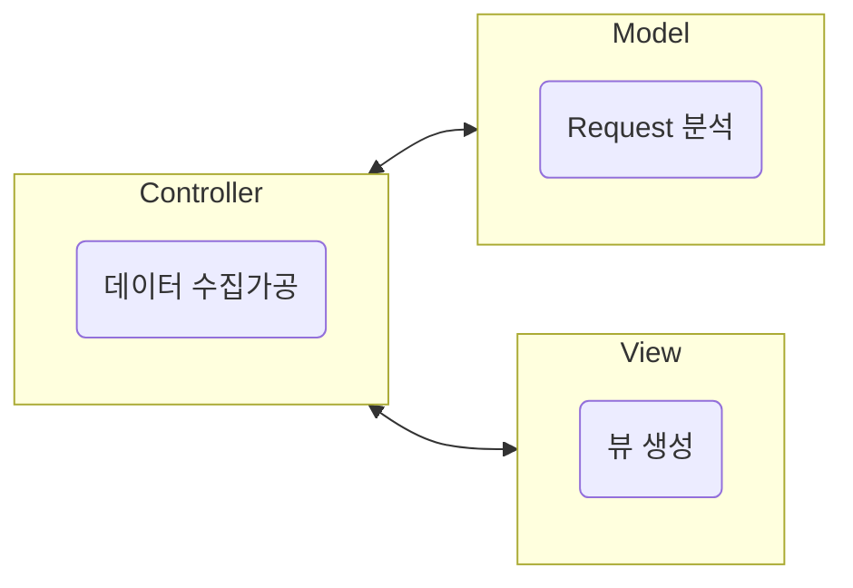
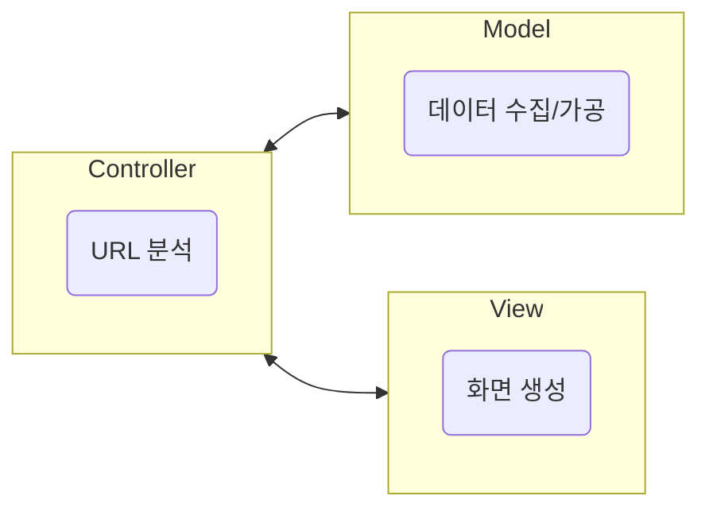
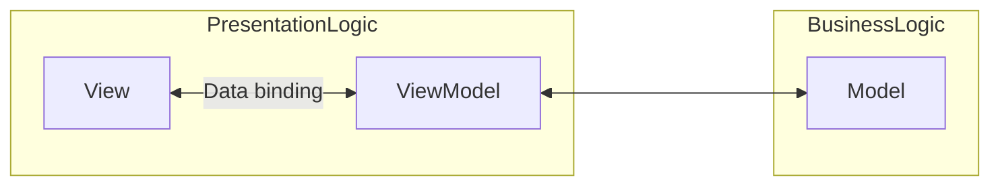
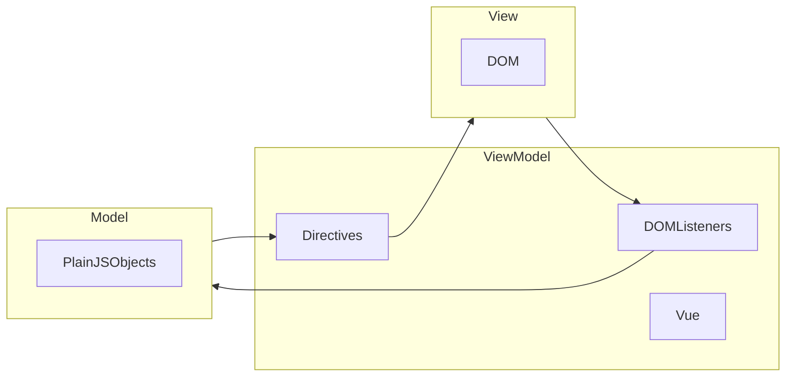
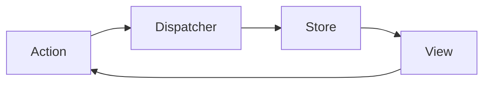

# Design patterns intro

<!-- START doctoc generated TOC please keep comment here to allow auto update -->
<!-- DON'T EDIT THIS SECTION, INSTEAD RE-RUN doctoc TO UPDATE -->

- [MVC](#mvc)
- [데이터 바인딩](#%EB%8D%B0%EC%9D%B4%ED%84%B0-%EB%B0%94%EC%9D%B8%EB%94%A9)
- [MVVM](#mvvm)
- [Flux 아키텍쳐](#flux-%EC%95%84%ED%82%A4%ED%85%8D%EC%B3%90)

<!-- END doctoc generated TOC please keep comment here to allow auto update -->

[프롱트 - youtube](https://www.youtube.com/watch?v=Y5vOfv67h8A)

## MVC

주로 BE에서 많이 사용됨.

1. client의 request를 받는다.
2. request를 분석한다(routing). - Controller
3. 필요한 데이터를 수집/가공한다. - Model
4. view를 생성한다. - View
5. response한다. - Controller

각각의 스텝들 간 의존성이 강하다. 각각의 레이어들이 반대 쪽에 있는, 다음에 있는 레이어의 존재를 알고 있어야 된다는 문제가 존재한다.

model이 view를 알지 못하게 하기 위해서



와 같은 구조를 많이 택한다.

BE에서는 유용하지만 FE에서는? SPA의 경우 페이지 전환없이 url에 따라 페이지 내용만 업데이트 하기 위해서 MVC가 사용가능하다.



이런 Request를 제외하고는 FE에서는 거의 모든게 다 View에 속한다. 게다가 이 View에서 온갖 이벤트가 발생하기에 View 자체가 Controller로서 작동하고 있다.

간단하게 이 FE의 View에서 일어나고 있는 것을 나열해보면

1. 사용자 입력값
2. 화면 선택, 변경
3. 스케쥴(Promise, setTimeout)
4. 서버 통신

위 일들을 View와 Model의 관계로 보면

1. View의 변경으로 Model이 바뀌야 하는 경우 (e.g. 복잡한 form에서 서로소 유니온을 사용하는 경우)
2. Model의 변경으로 View를 바꿔야 하는 경우(e.g. 제일 흔한 경우, 데이터에 의해 렌더링)
3. Model과 View는 양방향 통신을 한다.
4. 게다가 FE의 View는 개수가 많다.

이 문제를 해결하기 위해 위 BE의 MVC처럼 Controller를 만든다고 하면 엄청나게 큰 Controller가 필요해지는건 인지상정.

게다가 View는 DOM을 따라 트리구조로 계층을 가진 경우가 많기에 이에 대한 처리도 필요하다.

FE에 MVC를 적용하면 일어나는 일들을 정리하면

1. View가 아주 많다.
2. 양방향 처리가 필요하다.
3. 비대한 Controller가 생긴다.
4. View간의 계층처리가 필요하다.
5. 복잡한 View, Model 관계를 단순화하고 View 계층처리로 re-rendering이 적게 일어날 수 있도록 DOM 처리도 해줘야한다.

## 데이터 바인딩

[vue - form input binding](https://vuejs.org/guide/essentials/forms)

```html
<script setup>
  import { ref } from 'vue';

  const message = ref('test');
</script>

<template>
  <p>{{ message }}</p>
  <p />
  <input v-model="message" />
</template>
```

View가 바뀌면 Model이 바뀌고, Model이 바뀌고 View가 바뀌는걸 직접 구현하는건 어려울 수도 있다. Object.defineProperty을 쓰거나 Proxy API, Observer 패턴 등으로 해줘야함. 이를 양방향 바인딩Two way data binding이라 한다.

그렇기에 Vue나 Svelete등에선 위와 같은 API를 제공해준다.

## MVVM

Binder 역할을 하는 VM



View에서 쓰는 Model을 가지고 있다가 View에 업데이트가 있으면 ViewModel이 업데이트되고 반대의 경우도 마찬가지.



## Flux 아키텍쳐

한 방향으로 흐름을 제어하며 동작



View가 계층적인 처리를 해야하고, Model과 View가 서로 간에 계속 호출을 한다. React는 이 문제를 흐름제어를 통해서 풀어낸 방법론.

여기에 이제 Redux나 Recoil같은 상태관리 라이브러리들은 이 Flux를 따라서 만들다가 MVVM의 양방향 데이터 바인딩을 첨가한 느낌으로 받아들이면 된다.
