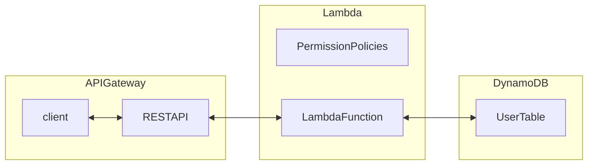

# 하루만에 배우는 aws 서버리스 아키텍쳐

<!-- START doctoc generated TOC please keep comment here to allow auto update -->
<!-- DON'T EDIT THIS SECTION, INSTEAD RE-RUN doctoc TO UPDATE -->

- [서버리스 아키텍쳐의 이점](#%EC%84%9C%EB%B2%84%EB%A6%AC%EC%8A%A4-%EC%95%84%ED%82%A4%ED%85%8D%EC%B3%90%EC%9D%98-%EC%9D%B4%EC%A0%90)
- [서버리스 아키텍쳐의 개요](#%EC%84%9C%EB%B2%84%EB%A6%AC%EC%8A%A4-%EC%95%84%ED%82%A4%ED%85%8D%EC%B3%90%EC%9D%98-%EA%B0%9C%EC%9A%94)
- [AWS 계정 설정](#aws-%EA%B3%84%EC%A0%95-%EC%84%A4%EC%A0%95)
  - [루트 계정](#%EB%A3%A8%ED%8A%B8-%EA%B3%84%EC%A0%95)
  - [IAM 계정](#iam-%EA%B3%84%EC%A0%95)
- [AWS API Gateway 종류](#aws-api-gateway-%EC%A2%85%EB%A5%98)
  - [RESTful API](#restful-api)
  - [WEBSOCKET API](#websocket-api)

<!-- END doctoc generated TOC please keep comment here to allow auto update -->

서버를 프로비저닝하거나 관리하지 않아도 되는 클라우드 컴퓨팅 모델

TODO: 프로비저닝, 컴퓨팅 모델 찾아보기

이벤트 기반 아키텍쳐 지원, 애플리케이션 특정 이벤트 발생 때마다 자동으로 실행가능
aws는 페이-애즈-유-고 모델, 사용한만큼 돈내기

## 서버리스 아키텍쳐의 이점

코드가 실제로 사용하는 컴퓨팅 시간(밀리초) 지불
마이크로 서비스, 이벤트 기반 애플리케이션 및 API 구축에 적합
서버 관리나 인프라 확장에 대한 걱정없음

- 개발시간 단축
- 비용절감
- 오토 스케일링
- 간편한 API 구축

MSA구조를 가지는 서비스들에 적합 - 대화형 앱 및 API기반 마이크로서비스 또는 애플리케이션, 데이터 처리 응용프로그램, 실시간 스트리밍 어플리케이션, 기계 학습, IT 자동화 및 서비스 조정

일반적으로 다음과 같은 유형의 솔루션을 서버리스로 구축함

- 대화형(동기식) - 웹 애플리케이션, 웹 서비스, 마이크로 서비스, 웹 후크
- 스트리밍 - 어플리케이션, IoT 장치에서 인바운드 데이터 스트림 처리
- 백그라운드 데이터 처리(비동기식) - 빅데이터 처리, 이미지/비디오 조작, 웹 후크

## 서버리스 아키텍쳐의 개요

1. AWS Lambda

   lambda는 서버를 관리할 필요없이 코드를 실행할 수 있는 컴퓨팅 서비스. 수신되는 트래픽 양에 따라 애플리케이션 크기 자동 조정

2. Amazon API gateway

   이 서비스는 규모에 맞게 API생성, 게시 및 관리할 수 있는 완벽하게 관리되는 서비스. AWS Lambda 함수와 통합되는 RESTful API를 쉽게 만들 수 있음

3. Amazon DynamoDB

   모든 규모의 고성능을 제공하도록 설계된? NoSQL 데이터베이스. MongoDB를 기반으로 둠

## AWS 계정 설정

MFA 계정, 어드민 계정

### 루트 계정

AWS에 처음 가입하면 생성되는 계정
해당 계정에서 특정 권한들을 가지는 어드민 계정들을 만들어서 사용할 것

IAM > 사용자 그룹 > AdministratorAccess 권한 부여한 그룹 생성

IAM > 사용자 > 콘솔 엑세스 권한 제공 > 직접 정책 연결 > AdministratorAccess 권한 부여한 IAM 사용자 생성

### IAM 계정

TODO: 차이점 찾아보기

## AWS API Gateway 종류

### RESTful API

1. HTTP API가 더 쌈 거의 3배 정도
2. REST API는 기능이 많음. 유저마다 key를 지원해줘야 하거나 swagger 지원 등

### WEBSOCKET API

채팅 및 스트리밍
