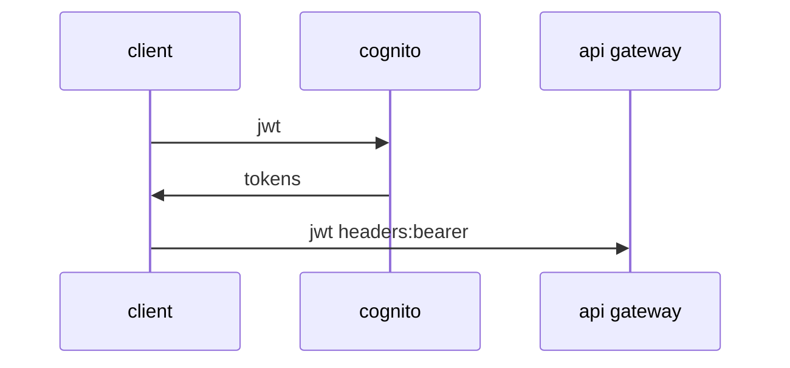

# aws cognito

<!-- START doctoc generated TOC please keep comment here to allow auto update -->
<!-- DON'T EDIT THIS SECTION, INSTEAD RE-RUN doctoc TO UPDATE -->

- [aws cognito](#aws-cognito)

<!-- END doctoc generated TOC please keep comment here to allow auto update -->

serverless를 사용하지 않아도 많이 사용함. 인증Authentication과 인가Authorization

