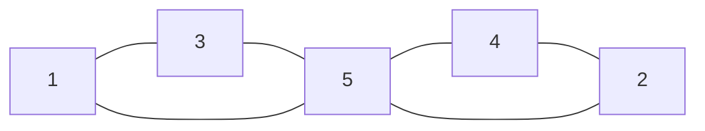

# Graph

<!-- START doctoc generated TOC please keep comment here to allow auto update -->
<!-- DON'T EDIT THIS SECTION, INSTEAD RE-RUN doctoc TO UPDATE -->

- [종류](#%EC%A2%85%EB%A5%98)
- [활용](#%ED%99%9C%EC%9A%A9)
- [표현 방법](#%ED%91%9C%ED%98%84-%EB%B0%A9%EB%B2%95)
  - [인접 리스트adjacency list](#%EC%9D%B8%EC%A0%91-%EB%A6%AC%EC%8A%A4%ED%8A%B8adjacency-list)
  - [인접 행렬adjacency matrix](#%EC%9D%B8%EC%A0%91-%ED%96%89%EB%A0%ACadjacency-matrix)
  - [암시적 그래프implicit graph](#%EC%95%94%EC%8B%9C%EC%A0%81-%EA%B7%B8%EB%9E%98%ED%94%84implicit-graph)
- [그래프 순회](#%EA%B7%B8%EB%9E%98%ED%94%84-%EC%88%9C%ED%9A%8C)
  - [순회의 시간복잡도](#%EC%88%9C%ED%9A%8C%EC%9D%98-%EC%8B%9C%EA%B0%84%EB%B3%B5%EC%9E%A1%EB%8F%84)

<!-- END doctoc generated TOC please keep comment here to allow auto update -->

그래프는 어떤 자료나 개념을 표현하는 정점Vertex들의 집합 V와 이들을 연결하는 간선Edge들의 집합E로 구성됨.

트리는 계층구조가 있고 일방향이었지만 그래프는 양방향도 가능. 그렇기에 모든 트리는 그래프라고 할 수 있다. 즉 트리는 그래프의 부분집합.

## 종류

1. 방향 그래프 vs 무향 그래프: 말 그대로 일방향 OR 양방향 관계가 정의되어 있는지
2. 다중 그래프 vs 단순 그래프: 정점과 정점 사이에 간선이 하나뿐이면 단순 그래프, n개 이상이면 다중 그래프
3. 가중치 그래프 -> 다익스트라

대부분 무향 + 단순 그래프의 조합을 생각하면 된다

## 활용

현실 세계의 사물이나 추상적인 개념 간의 연결관계를 표현한다. 그렇기에 현실의 문제를 해결하기 위한 도구로써 사용됨

e.g.

- 도시들을 연결하는 도로망
- 지하철 연결 노선도
- 컴퓨터 네트워크
- 소셜 네트워크 분석

## 표현 방법



### 인접 리스트adjacency list

```js
const graph = {
  1: [3, 5],
  2: [4, 5],
  3: [1, 5],
  4: [2, 5],
  5: [1, 2, 3, 4],
};
```

가장 많이 보일 유형, 공간도 덜 차지하고 활용도도 높음

### 인접 행렬adjacency matrix

```js
const graph = [
  [0, 0, 1, 0, 1],
  [0, 0, 0, 1, 1],
  [1, 0, 0, 0, 1],
  [0, 1, 0, 0, 1],
  [1, 1, 1, 1, 0],
];
```

위 예시는 무향 그래프니까 1번이 3번에 연결되어 있다는 것은 3번도 1번에 연결되어 있다는 것이니, 좌측 상단부터 우측 하단까지 대각선을 그어보면 행렬 자체가 데칼코마니임.

### 암시적 그래프implicit graph

미로찾기 문제, 벽을 1로 하고 길을 0으로 지정하면

```bash
⬛⬛⬛⬛⬛ 1 1 1 1 1
⬜⬜⬜⬛⬛ 0 0 0 1 1
⬛⬛⬜⬛⬛ 1 1 0 1 1
⬛⬜⬜⬜⬜ 1 0 0 0 0
⬛⬛⬛⬛⬛ 1 1 1 1 1
```

위와 같이 될텐데, 모든 숫자들을 정점vertex라고 생각하고 각 칸마다 인접 행렬 혹은 리스트로 작성하는 건 너무 비효율적이다.

```js
// 모든 칸을 정점으로 지정하고 간선을 표현해주는 건 비효율
const adjacencyList = {
  1: [2, 6], // 첫번째 칸이 두번째 그리고 다음 열 첫번째
  2: [1, 3, 7], // 두번째 칸이 첫번째 세번째 그리고 다음열 두번째
  3: [2, 4, 8],
  ...
};

// 암시적으로 관계는 표현하지 않았지만, 관계가 있다는 걸 알 수 있음
const implicitGraph = [
  [1, 1, 1, 1, 1],
  [0, 0, 0, 1, 1],
  [1, 1, 0, 1, 1],
  [1, 0, 0, 0, 0],
  [1, 1, 1, 1, 1],
];
```

## 그래프 순회

각 장점을 방문하는 과정, BFS 그리고 DFS이 있다. 트리와 마찬가지로 완전탐색이다.

### 순회의 시간복잡도

각각의 순회는 정점$V$들을 탐색해야하고 그러기 위해 모든 간선$E$들을 확인해봐야 하기에 시간복잡도는 $O(V + E)$
