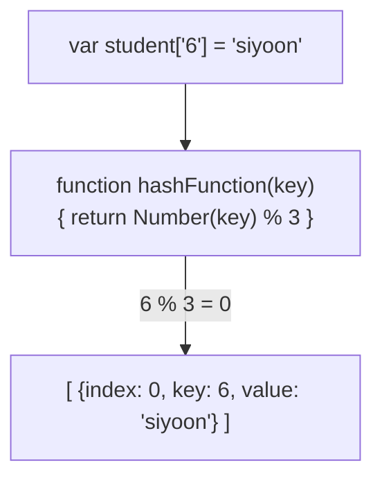
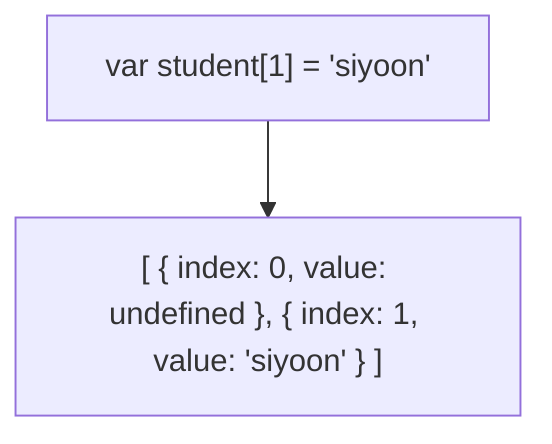

# Hash Table

<!-- START doctoc generated TOC please keep comment here to allow auto update -->
<!-- DON'T EDIT THIS SECTION, INSTEAD RE-RUN doctoc TO UPDATE -->

- [Collision](#collision)

<!-- END doctoc generated TOC please keep comment here to allow auto update -->

시간복잡도를 줄이기 위해서 메모리를 더 쓰는 방식으론 최고

구현방식이 크게 두자기 Array list based(Open addressing), Find key $O(1)$

hash table은 빠른 탐색을 위한 자료구조로써 key-value쌍의 데이터를 입력받음. hash function $h$에 key값을 넣어 얻은 해시 값 $h(k)$를 위치로 지정하여 key-value 데이터쌍을 저장함. 저장, 삭제, 검색 모두 시간복잡도 $O(1)$

결국 key-value을 가진 array인데 index값만 hash값인 것

hash table와 비교되는 direct-address table은

1. key값을 string으로 못 쓴다.
2. 만약 key값 시작을 0이 아닌 예로들어 1024으로 했으면 앞의 낭비 메모리들이 생긴다.

## Collision

hashFunction이 모종의 이유로 같은 index를 반환하게 되면 index 충돌이 일어난다.

해결하는 방법 2가지. open addressing, seperate chaining

open addressing은 간단하게 index가 겹치면 다음 index를 테스트해보는 것

TODO: 내용 더 찾아보기
