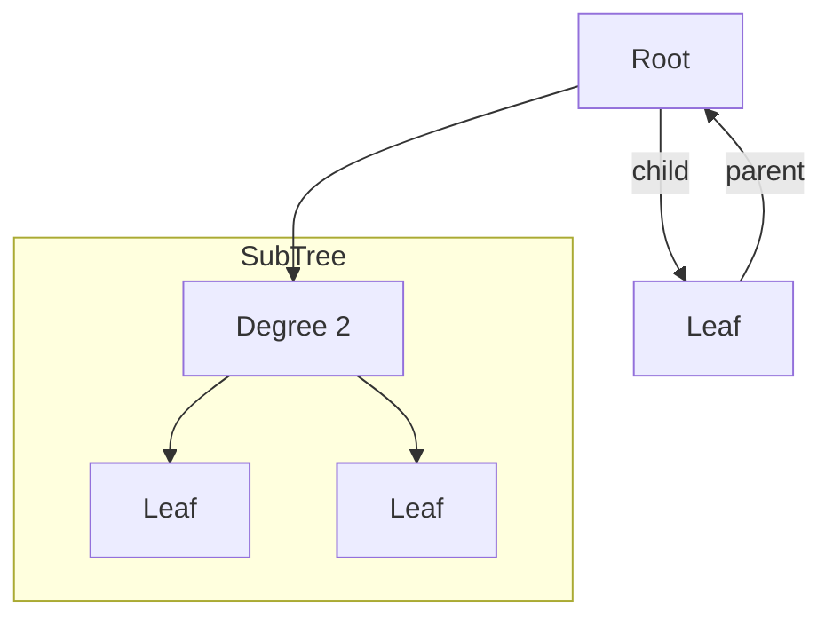

# Tree

<!-- START doctoc generated TOC please keep comment here to allow auto update -->
<!-- DON'T EDIT THIS SECTION, INSTEAD RE-RUN doctoc TO UPDATE -->

- [Tree](#tree)

<!-- END doctoc generated TOC please keep comment here to allow auto update -->

## Terms

- 노드Node: 트리는 보통 노드로 구현됨
- 간선Edge: 노드간 연결된 선
- 루트 노드Root: 시작되는 노드
- 리프 노드Leaf: 마지막 노드
- 자식 노드Child, 부모 노드Parent, 형제 노드Sibling
- 차수Degree: 각 노드가 갖는 자식의 수, 모든 노드의 차수가 n개 이하인 트리를 n진 트리라고 함
- 조상Ancestor: 위쪽 간선을 따라가면 만나는 모든 노드
- 자손Descendant: 아래쪽 간선을 따라가면 만나는 모든 노드
- 높이Height: 루트 노드에서 가장 멀리 있는 리프 노드까지의 거리, 리프 노드 중 최대 레벨 값
- 서브트리Subtree: 트리의 어떤 노드를 루트로 하고, 그 자손으로 구성된 트리는 서브트리

위 트리같은 경우 높이는 0(Root),1,2 까지 있음으로 높이가 2, 모든 노드의 차수가 2이하 이니까 2진 트리

## Binary Tree

2진 트리
완전 2진 트리는 마지막 레벨을 제외하고 마지막 - 1 레벨까지는 모든 노드들이 채워져 있는 경우. 안채워져 있는 경우 그냥 2진 트리. Heap 자료구조에서 사용됨.
