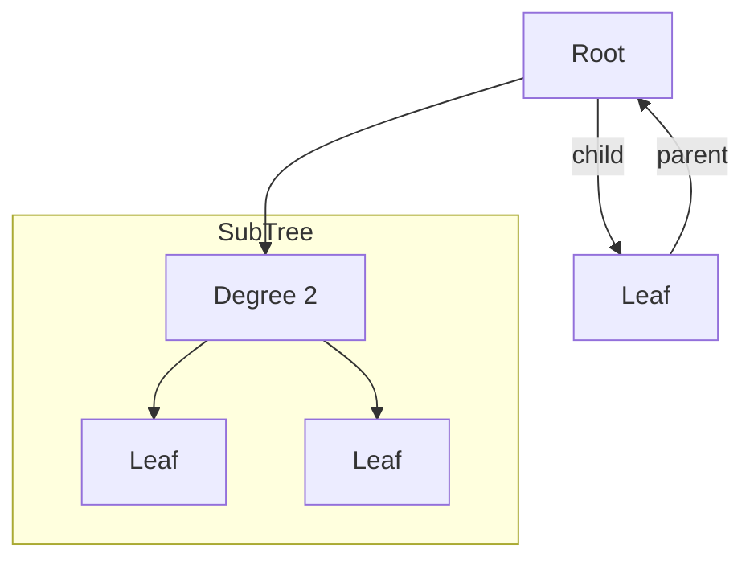

# Tree

<!-- START doctoc generated TOC please keep comment here to allow auto update -->
<!-- DON'T EDIT THIS SECTION, INSTEAD RE-RUN doctoc TO UPDATE -->

- [Terms](#terms)
- [Binary Tree](#binary-tree)
- [Tree Traversal](#tree-traversal)
- [시간복잡도](#%EC%8B%9C%EA%B0%84%EB%B3%B5%EC%9E%A1%EB%8F%84)

<!-- END doctoc generated TOC please keep comment here to allow auto update -->

## Terms

- 노드Node: 트리는 보통 노드로 구현됨
- 간선Edge: 노드간 연결된 선
- 루트 노드Root: 시작되는 노드
- 리프 노드Leaf: 마지막 노드
- 자식 노드Child, 부모 노드Parent, 형제 노드Sibling
- 차수Degree: 각 노드가 갖는 자식의 수, 모든 노드의 차수가 n개 이하인 트리를 n진 트리라고 함
- 조상Ancestor: 위쪽 간선을 따라가면 만나는 모든 노드
- 자손Descendant: 아래쪽 간선을 따라가면 만나는 모든 노드
- 높이Height: 루트 노드에서 가장 멀리 있는 리프 노드까지의 거리, 리프 노드 중 최대 레벨 값
- 서브트리Subtree: 트리의 어떤 노드를 루트로 하고, 그 자손으로 구성된 트리는 서브트리

위 트리같은 경우 높이는 0(Root),1,2 까지 있음으로 높이가 2, 모든 노드의 차수가 2이하 이니까 2진 트리

## Binary Tree

2진 트리
완전 2진 트리는 마지막 레벨을 제외하고 마지막 - 1 레벨까지는 모든 노드들이 채워져 있는 경우. 안채워져 있는 경우 그냥 2진 트리. Heap 자료구조에서 사용됨.

## Tree Traversal

트리 순회, 트리 탐색
트리의 각 노드를 방문하는 과정. 모든 노드를 한 번씩 방문 해야 하므로 완전 탐색이라고도 부름.

순회 방법으로는 너비 우선 탐색BFS와 깊이 우선 탐색DFS가 있다.

접근과 방문을 나눠서 생각해야함. 접근은 말그대로 read만 하는 것 무언가 행위는 없음. 방문은 접근해서 무얼 했을 때.

너비 우선 탐색BFS은 루트 노드를 기준으로 한 레벨씩 다 탐색하고 다음 레벨을 탐색하는 방식. Queue를 이용하게 됨. level order traversal이라고도 부름

깊이 우선 탐색DFS은 Stack + 반복문 혹은 재귀를 이용해서 구현하는 방식이 있음. 보통은 재귀를 많이 씀.

DFS의 방문에는 3가지 방식이 있음.

- 전위순회preorder - 다음 노드L,R에 접근하기 전에 현재 노드에서 먼저 특정행위를 먼저 하는 것
- 중위순회inorder - 다음 노드L에 접근 하고 -> 특정 행위를 한 다음에 -> 다음 노드R에 접근하는 것, 한쪽 자식들을 다 방문한 이후에 나 자신을 방문하고 다른 쪽 자식을 방문하는 방식. 흐름 상 백도를 할 때 방문.
- 후위순회postorder - 다음 노드L,R에 접근한 이후에 특정 행위를 하는 것. 모든 자식을 방문하고 나 자신을 방문하는 방식.

## 시간복잡도

재귀의 시간복잡도 = 재귀 함수 호출 수 $\times$ (재귀 하나당) 시간 복잡도

재구기 함수 호출 수 = $n$ $\times$ 재귀 함수 하나당 시간 복잡도 = $O(1)$ $=$ 전위, 중위, 후위의 시간 복잡도는 $O(n)$
