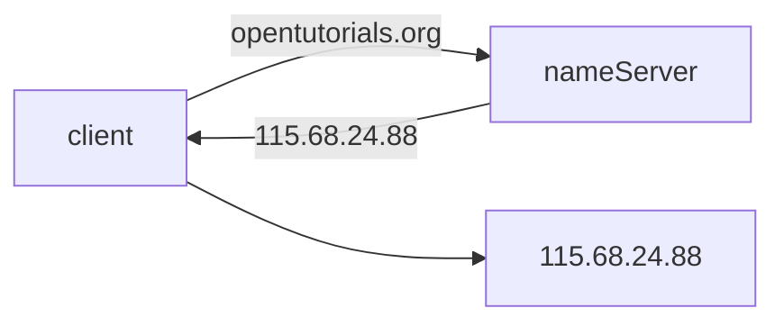

# Domain, host

<!-- START doctoc generated TOC please keep comment here to allow auto update -->
<!-- DON'T EDIT THIS SECTION, INSTEAD RE-RUN doctoc TO UPDATE -->

- [Domain, host](#domain-host)

<!-- END doctoc generated TOC please keep comment here to allow auto update -->

- IP - 인터넷에 연결되어 있는 모든 장치 각각의 식별 가능한 주소(e.g. 115.68.24.88)
- Domain - IP는 사람이 이해하기 기억하기 어렵기 때문에 이를 위해 각 IP에 이름을 부여 할 수 있게 만들어 둔 것(e.g. naver.com -> 220.95.233.172)
  - daum.co.kr을 예시로 daum은 컴퓨터 이름, co은 국가 형태의 최상위 도메인, kr은 대한민국 NIC에서 관리하는 도메인
  - opentutorials.org에서는 opentutorials이 컴퓨터 이름, org는 최상위 도메인(비영리단체)
- URL - domain + path
  - domain은 opentutorials.org
  - URL은 https://www.opentutorials.org/course/1

client가 한번도 opentutorials.org을 방문한 적 없다면 nameServer한테 domain을 가지고 IP를 물어보게 됨.
nameServer로부터 받은 IP를 가진 컴퓨터에 사이트를 요청하고 받아옴.
