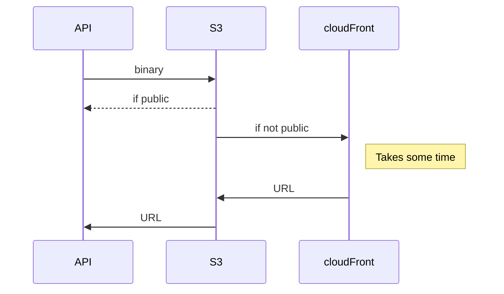
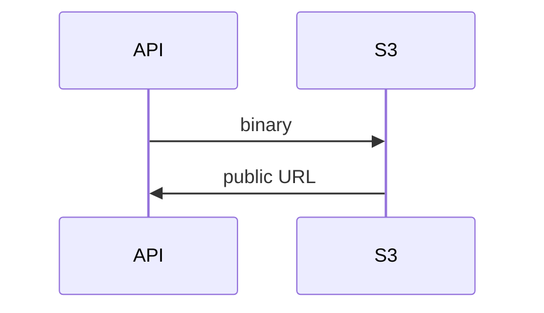
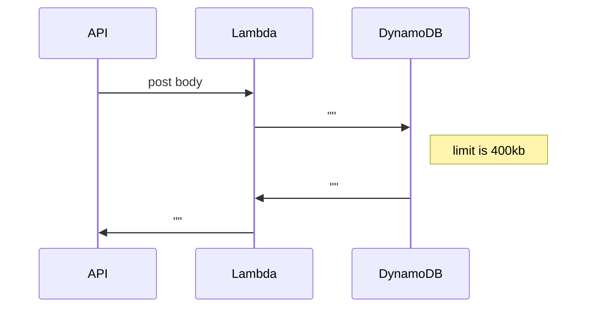

# Image upload REST API

<!-- START doctoc generated TOC please keep comment here to allow auto update -->
<!-- DON'T EDIT THIS SECTION, INSTEAD RE-RUN doctoc TO UPDATE -->

- [S3 직접 업로드 방식](#s3-%EC%A7%81%EC%A0%91-%EC%97%85%EB%A1%9C%EB%93%9C-%EB%B0%A9%EC%8B%9D)
- [Lambda](#lambda)
- [Form-data](#form-data)

<!-- END doctoc generated TOC please keep comment here to allow auto update -->

3가지 방식이 있음.

1. POST body 바이너리
2. POST form-data
3. 바이너리 파일 - s3로 데이터를 넣는 방법

## S3 직접 업로드 방식

## Lambda

mongoDB는 10MB

## Form-data

nodejs의 multer를 많이 사용

