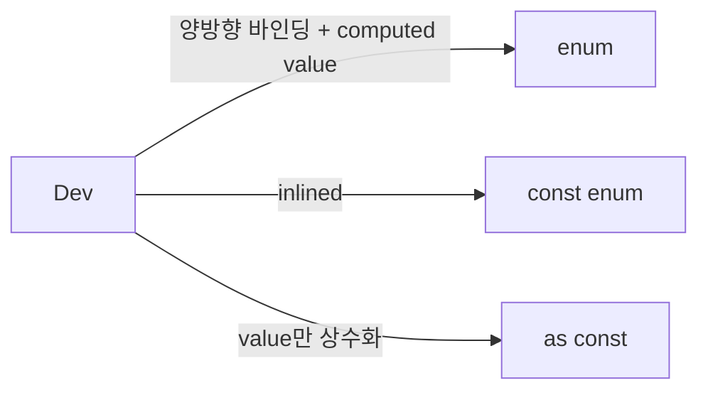

# Enums

<!-- START doctoc generated TOC please keep comment here to allow auto update -->
<!-- DON'T EDIT THIS SECTION, INSTEAD RE-RUN doctoc TO UPDATE -->

- [결론](#%EA%B2%B0%EB%A1%A0)
- [Ref links](#ref-links)
- [개념](#%EA%B0%9C%EB%85%90)
- [enum](#enum)
- [const enum](#const-enum)
- [as const](#as-const)
- [TODO](#todo)

<!-- END doctoc generated TOC please keep comment here to allow auto update -->

## 결론



string union을 예로 들어 LogLevel이 `'error' | 'warning' | 'debug'` 셋 중 하나의 값이어야 할때

1. 해당 value만 쓴다면 `type Loglevel = 'error' | 'warning' | 'debug'`로 충분하다.
2. value와 key값을 상이하게 하거나 mapping이 필요하다면 as const를 고려해보자
3. enum과 const enum은 1,2번 이상의 스펙이 필요할 때 고려해보자

## Ref links

- [enum, const enum, as const](https://xpectation.tistory.com/218)
- [ ㅇMatt Pocock - enums considered harmful](https://www.youtube.com/watch?v=jjMbPt_H3RQ)

## 개념

- Enumerated Type의 축약
- js에는 없고 ts만의 기능, js에만 없을 뿐 다른 안어에서는 있음 readonly key-value로 사용하고 싶을 때 + 가독성

## enum

- 컴파일 시 코드 양이 증가된다
- key-value의 양방향으로 정의되어 필요충분조건으로 돌아가기에 readonly와 유사해진다

```ts
enum LogLevel {
  DEBUG,
  WARNING,
  ERROR,
}

// 위 코드는 아래와 같이 컴파일된다

var LogLevel;
(function (LogLevel) {
  LogLevel[(LogLevel['DEBUG'] = 0)] = 'DEBUG';
  LogLevel[(LogLevel['WARNING'] = 1)] = 'WARNING';
  LogLevel[(LogLevel['ERROR'] = 2)] = 'ERROR';
})(LogLevel || (LogLevel = {}));

// 위 즉시실행햄수의 실행결과는 아래와 같다

const LOG_LEVEL = {
  '0': 'DEBUG',
  '1': 'WARNING',
  '2': 'ERROR',
  DEBUG: 0,
  WARNING: 1,
  ERROR: 2,
};
```

위 예시는 string union으로 사용하고 싶을땐 원하지 않는 결과 일 것이다.
key-value가 양방향으로 구현되기에, enum의 key값은 숫자로 지정할 수 없다

```ts
enum LogLevel {
  DEBUG = 'DEBUG',
  WARNING = 'WARNING',
  ERROR = 'ERROR',
}

// 위 코드와 같이 쓸때가 많은데(string union으로 쓰고 싶은 경우엔)
// 하지만 실사용시 아래와 같은 경우 막힌다

function log(level: LogLevel) {
  console.log(level);
}

log('DEBUG'); // 이 코드는 타입 에러를 일으킨다
log(LogLevel.DEBUG); // 이렇게 써야한다
```

심지어 위 같은 경우 아래와 같이 값이 똑같더라도 문제가 생긴다

```ts
enum LogLevel {
  DEBUG = 'DEBUG',
}

enum LogLevel2 {
  DEBUG = 'DEBUG',
}

function log(level: LogLevel) {
  console.log(level);
}

log(LogLevel2.DEBUG); // 타입 에러
```

## const enum

- enum과 다르게 key-value 양방향 관계가 정의되지 않는다
- 컴파일 시 enum과 다르게 코드양을 증가시키지 않는다
- 코드양을 증가 시키지않는 이유로는 inlined(컴파일시 내부 코드를 caller에 치환시켜 넣어서 함수 호출 과정을 없앰) 되기 때문이다

```ts
const enum LogLevel {
  DEBUG = 'DEBUG',
  WARNING = 'WARNING',
  ERROR = 'ERROR',
}

function log(level: LogLevel) {}

log(LogLevel.DEBUG);

// const enum 사용시 아래와 같이 파싱된다

function log(level) {}
log('DEBUG' /* LogLevel.DEBUG */);
```

const enum 사용시 런타임에서는 enum 자체가 사라진다. enum은 타입 시스템 내에서만 존재해서 되게 좋아보이지만 [단점, const enum pitfall](https://www.typescriptlang.org/docs/handbook/enums.html#const-enum-pitfalls)도 있다.

## as const

- enum과 다르게 양방향 바인딩 없음
- const assertion, 상수가 아닌 것을 상수로 주장? 전제 하는 것
- 할당된 특정 값 그 자체를 type으로 취급하는 literal type으로 지정하는 것, ts의 타입 추론을 잠시 멈추고

```ts
const LOG_LEVEL = {
  DEBUG: 'Debug',
  WARNING: 'Warning',
  ERROR: 'Error',
} as const;

type ObjectValues<T> = T[keyof T];

type LogLevel = ObjectValues<typeof LOG_LEVEL>;

function log(level: LogLevel) {
  console.log(LOG_LEVEL[level]);
}

// 아래 둘다 된다
log(LOG_LEVEL.DEBUG);
log('DEBUG');
```

## TODO

- [인라인 함수](https://namu.wiki/w/%EC%9D%B8%EB%9D%BC%EC%9D%B8%20%ED%95%A8%EC%88%98)
