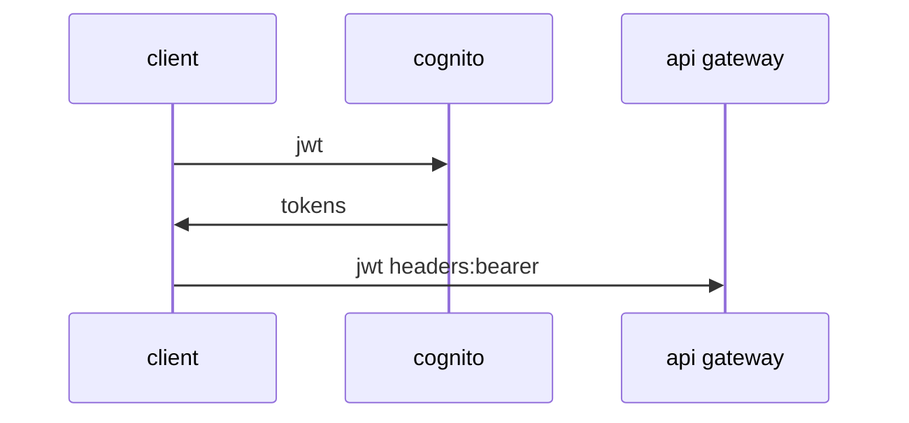

# aws cognito

serverless를 사용하지 않아도 많이 사용함. 인증Authentication과 인가Authorization

```mermaid
sequenceDiagram
    participant client
    participant cognito
    participant api gateway

    client->>cognito:jwt
    cognito->>client:tokens
    client->>api gateway:jwt headers:bearer
```
