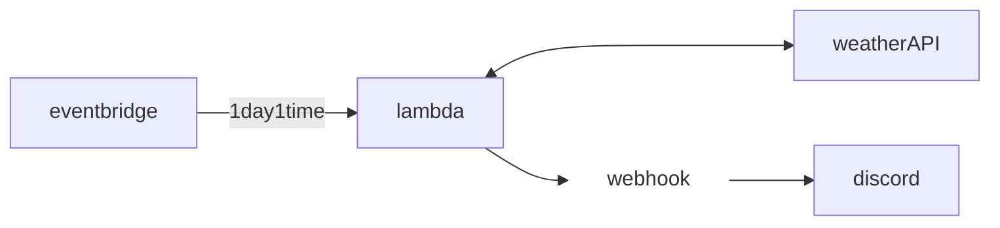

# Eventbridge

lambda 함수의 트리거를 마음대로 설정할 수 있는 것. cron job을 돌릴 수도 있다.

## 디스코드 날씨 알림 봇



[weatherAPI](https://openweathermap.org/api)의 [weatherAPI.current](https://openweathermap.org/current)를 사용

### Lambda 함수 생성

```js
/* global fetch */
export const handler = async (event) => {
  const city = 'tokyo';
  const apiKey = 'XXX';
  const domain = 'https://api.openweathermap.org';
  const res = await fetch(
    `${domain}/data/2.5/weather?q=${city}&appid=${apiKey}`,
  );

  if (!res.ok) return null;

  const json = await res.json();
  const main = json.weather[0].main;
  const description = json.weather[0].description;
  const dateTime = new Date((json.dt + json.timezone) * 1000);

  // TODO implement
  const response = {
    statusCode: 200,
    body: JSON.stringify({ main, description, date: dateTime.toISOString() }),
  };

  return response;
};
```

### Discord 채널 설정

채널 만들기 > 채팅 채널 > 채팅 채널.채널 편집 > 연동.새 웹후크

[Discord webhook API](https://discord.com/developers/docs/resources/webhook#execute-webhook)
문서를 보고 연동하기

```js
  ...
  const description = json.weather[0].description;
  const dateTime = new Date((json.dt + json.timezone) * 1000);

  const webhookDomain = "https://discordapp.com/api/webhooks";
  const webhookId = "XXX";
  const webhookToken = "XXX";
  const webhookURL = [webhookDomain, webhookId, webhookToken].join("/");

  await fetch(webhookURL, {
    method:"POST",
    headers: {
      "Content-Type" : "application/json",
    },
    body: JSON.stringify({
      content: `[${dateTime.toISOString()}] ${city}is ${main}-${description}`
    })
  });

  const response = {
    statusCode: 200,
    body: JSON.stringify({ main, description, date: dateTime.toISOString() }),
  };
  ...
```

### Eventbridge 설정

lambda 트리거 추가 > eventBridge > Schedule expression > rate(1 minute)

[Schedule expression](https://docs.aws.amazon.com/eventbridge/latest/userguide/eb-create-rule-schedule.html)
